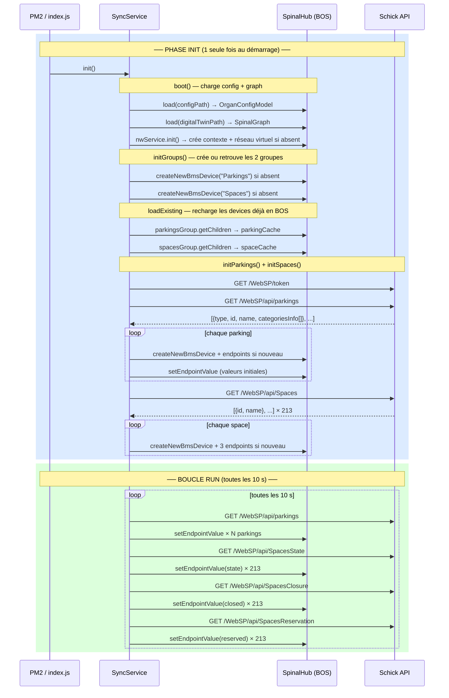

# spinal-organ-connector-parking-schick

Connecteur Spinal BOS pour l'API REST Schick Signal-Park (WebSP).

---

## Fonctionnement



---

## Structure BOS

```
Virtual Network Parking Schick
├── Parkings
│   └── {type}_{id}_{name}   ex: site_1_Schick LABO
│       endpoints: closed, reserved, ledOff, counted,
│                  totalCapacity, totalOccupied, totalVacant, totalAvailable,
│                  fillingRate, cat_{key}_capacity … cat_{key}_departures
└── Spaces
    └── space_{id}_{name}    ex: space_6_1 - 001
        endpoints: state, closed, reserved
```

---

## Installation

```bash
cp .env.example .env && nano .env
spinalcom-utils i
npm install
npm run build
```

## Démarrage

```bash
pm2 start ecosystem.config.js && pm2 save
```

---

## Variables d'environnement

| Variable | Obligatoire | Description |
|----------|-------------|-------------|
| `SPINAL_USER_ID` | oui | ID utilisateur SpinalHub |
| `SPINAL_PASSWORD` | oui | Mot de passe SpinalHub |
| `SPINALHUB_IP` | oui | Adresse du SpinalHub |
| `SPINALHUB_PORT` | oui | Port du SpinalHub |
| `CLIENT_BASE_URL` | oui | URL base API Schick |
| `CLIENT_USER` | oui | Utilisateur API Schick |
| `CLIENT_PASSWORD` | oui | Mot de passe API Schick |
| `PULL_INTERVAL` | non (10000) | Intervalle de polling en ms |
| `NETWORK_NAME` | non | Nom du contexte réseau BMS |
| `VIRTUAL_NETWORK_NAME` | non | Nom du réseau virtuel |
